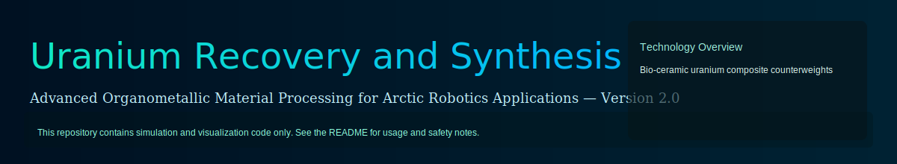

```markdown
# Robotic Arm Simulation (2D) — Demo & UI

This folder contains a compact 2D robotic-arm kinematics and inverse-kinematics (IK) demo built for experimentation and visualization. The project is intentionally small and designed to be extended — for example by adding joint limits, richer inverse solvers, physics, or a more advanced UI.

Highlights
- Small, dependency-free core IK implementation in JavaScript using the CCD (Cyclic Coordinate Descent) algorithm.
- A simple command-line demo and test harness.
- A lightweight browser UI that visualizes the arm on a Canvas, allows dragging a target, and supports attaching visual "components" to joints (camera, gripper, sensor, and counterweight).
- Support for previewing and attaching 3D assets (GLTF/GLB/OBJ or images) in the UI using a dynamic three.js import.

Files
- `index.js` — core `RoboticArm` class: forward kinematics and CCD-based IK solver. The solver accepts an optional `jointMasses` array to simulate heavier attachments (counterweights) reducing joint movement.
- `demo.js` — example script that runs several target solves and prints the results.
- `test.js` — small, runnable test that asserts the IK solver reaches example targets.
- `ui/` — browser UI (Canvas + optional three.js preview) with files:
	- `index.html` — UI page
	- `main.js` — UI logic (ES module) that imports `../index.js`
	- `style.css` — UI styles
	- `assets/` — bundled assets (example `counterweight.obj` is included)

Quick start (command line)

From repository root, run the demo or tests:

```bash
# Run the demo (prints example solves)
node simulations/robotic-arm/demo.js

# Run the tests
node simulations/robotic-arm/test.js
```

Open the UI (browser)

The UI imports `../index.js` as an ES module; it must be served over HTTP (not opened via `file://`). From the project folder you can run a simple static server, for example:

```bash
cd simulations/robotic-arm/ui
python3 -m http.server 8001
# then open http://localhost:8001 in your browser
```

UI features
- Drag the main Canvas to move the IK target.
- Toggle auto-solve and control solver parameters (max iterations, tolerance).
- Attach visual components to joints using the controls. The "Counterweight" component accepts a mass (kg) and affects the IK solver via a simple scale factor.
- Upload an image or 3D model (GLTF/GLB/OBJ). Uploaded assets are previewed and can be attached to joints. The UI will dynamically import three.js and the necessary loaders for previews.

Included asset
- `ui/assets/counterweight.obj` — a small example 3D model (box) used by the demo UI as a built-in asset.

Extending the project
- Add joint limits, per-joint weights, or a Damped Least Squares (DLS) IK solver for better singularity handling.
- Replace CDN three.js imports with a local npm dependency and bundle with Vite or similar tooling if you need offline builds.
- Create a richer 3D visualization (embed three.js into the main canvas or use WebGL for the full scene).

Safety, ethics, and scope

This repository contains simulation and visualization code only. You may notice imagery or project notes that reference mining, counterweights, or materials processing. The repository does not contain operational instructions, recipes, or procedural guidance for processing hazardous materials (including uranium or radioactive sources). The included robotic simulation and 3D assets are intended solely for benign simulation, visualization, and educational purposes.

If your project deals with hazardous materials or regulated substances, follow all applicable laws, institutional policies, and safety best practices. Do not use or adapt this code to attempt real-world extraction, processing, or handling of radioactive or otherwise dangerous materials.

License & attribution
- This folder follows the repository license (see root `LICENSE`). The demo and UI are small, illustrative examples — feel free to adapt them for non-harmful use-cases. If you add or include third-party assets, ensure you have the appropriate rights and include attribution.

Contact / next steps
- If you want, I can:
	- Add OrbitControls and a more realistic PBR environment to the preview (this repo already supports dynamic three.js previewing).
	- Convert the UI into a bundled app (Vite) and add a local three.js dependency for offline use.
	- Add per-component offsets/inertia so attached counterweights affect dynamics more realistically.

```
